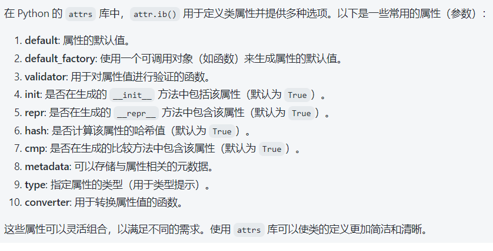

[toc]

# Python - Attr 模块的使用

## 一、attr.ib()的属性



## 二、converter 的使用

在 Python 的 `attrs` 模块中，`converter` 属性用于对属性值进行转换。这意味着在设置属性值时，可以自动将其转换为所需的类型或格式。这对于确保数据的一致性和避免错误非常有用。

### 基本用法

1. **定义转换函数**: 创建一个函数，该函数接受一个值并返回一个转换后的值。
2. **使用 `converter`**: 在 `attr.ib()` 中指定 `converter` 参数。

### 示例代码

以下是如何使用 `converter` 属性的示例：

```python
import attr

# 定义转换器函数
def to_int(value):
    return int(value)

@attr.s
class Person:
    name = attr.ib()
    age = attr.ib(converter=to_int)

# 使用示例
person1 = Person(name='Alice', age='30')  # 字符串会被转换为整数
print(person1)  # 输出: Person(name='Alice', age=30)

# 如果传入无效的字符串，可能会抛出异常
try:
    person2 = Person(name='Bob', age='not_a_number')
except ValueError as e:
    print(e)  # 输出: invalid literal for int() with base 10: 'not_a_number'
```

### 解释

- **转换器函数**: `to_int` 函数用于将传入的值转换为整数。如果提供的值不能转换为整数（例如，字符串 "not_a_number"），则会引发 `ValueError`。
- **使用 `converter`**: 在 `Person` 类中，`age` 属性使用了 `to_int` 作为转换器。这样，当创建 `Person` 实例时，如果传入的 `age` 是字符串，它会被自动转换为整数。

### 多个转换器

如果需要对属性应用多个转换，可以链式调用转换函数，或者在定义属性时使用组合逻辑。

### 示例 - 链式转换

```python
def to_float(value):
    return float(value)

@attr.s
class Measurement:
    value = attr.ib(converter=to_float)

measurement = Measurement(value='12.34')
print(measurement)  # 输出: Measurement(value=12.34)
```

### 总结

使用 `converter` 属性可以简化数据处理，确保属性值在实例创建时即符合预期的格式。这种方式使得代码更加可读和健壮，有助于减少潜在的错误。


上面的方法是类方法，如果是实例方法也可以需要借助`__attrs_post_init__`来实现。

是的，`converter` 参数可以使用实例方法。只需确保在调用时能够正确访问实例。通常，这可以通过使用 `functools.partial` 或 lambda 函数来实现。

### 示例

以下是一个使用实例方法作为 `converter` 的示例：

```python
import attr

@attr.s
class Person:
    name = attr.ib()

    def __attrs_post_init__(self):
        # 将属性值转换为大写
        self.name = self.convert_name(self.name)

    def convert_name(self, value):
        return value.upper()

# 使用示例
person = Person(name='john')
print(person.name)  # 输出: JOHN
```

在这个例子中，`convert_name` 是 `Person` 类的实例方法，用于将 `name` 属性的值转换为大写字母。在 `__attrs_post_init__` 方法中，我们对 `name` 进行了转换。

### 注意

如果希望在 `attr.ib()` 中直接使用实例方法作为 `converter`，需要传递一个可调用对象，并确保它接受正确的参数。在某些情况下，使用 `__attrs_post_init__` 是更简单和直接的方式。


## 三、validator 的使用

在 `attrs` 模块中，`validator` 属性用于对属性值进行验证。你可以定义一个或多个验证器函数，以确保在创建类的实例时，属性值符合特定的条件。

### 基本用法

1. **导入必要的模块**: 首先，你需要导入 `attr` 和相关的验证器。
2. **定义验证器**: 创建一个函数，该函数接受两个参数：实例对象和要验证的属性值。如果值不符合要求，则抛出异常。
3. **使用 `validator`**: 在 `attr.ib()` 中指定 `validator` 参数，传入你定义的验证器。

### 示例代码

```python
import attr

# 定义验证器函数
def age_validator(instance, attribute, value):
    if value < 0:
        raise ValueError(f"{attribute.name} must be a non-negative integer.")

@attr.s
class Person:
    name = attr.ib()
    age = attr.ib(validator=age_validator)

# 使用示例
try:
    person1 = Person(name='Alice', age=30)  # 正确
    print(person1)
    
    person2 = Person(name='Bob', age=-5)    # 触发验证器
except ValueError as e:
    print(e)  # 输出: age must be a non-negative integer.
```

### 解释

- **验证器函数**: `age_validator` 用于检查 `age` 是否为非负整数。如果传入负值，将抛出 `ValueError` 异常。
- **使用验证器**: 在 `Person` 类中，`age` 属性使用了 `age_validator` 作为验证器。
- **实例化**: 当尝试创建 `person2` 时，由于 `age` 为负值，验证器会抛出异常，捕获后会打印错误信息。

### 多个验证器

你也可以为同一个属性定义多个验证器，使用 `attr.validators.and_(...)` 或 `attr.validators.or_(...)` 来组合多个验证器。

#### 示例

```python
@attr.s
class Person:
    name = attr.ib()
    age = attr.ib(
        validator=attr.validators.and_(
            age_validator,
            attr.validators.instance_of(int)  # 确保是整数类型
        )
    )
```

### 总结

通过使用 `validator`，你可以确保属性的值始终满足特定的条件，提高代码的健壮性和可靠性。